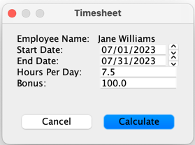
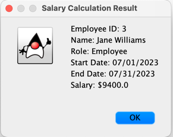

# HR Management System

This project delivers a system that allows a company to manage its employee schedules and pay.
A User of the system may be a manager or an employee. An employee can set their availability and can request time off using this system. The manager can generate their employees' schedules, have the system calculate their pay, and accept or reject time off requests.

## Table of Contents

- [Project Overview](#Project-Overview)
- [Overall Design](#overall-design)
- [Technologies Used](#technologies-used)
- [Installation](#installation)
- [Usage](#usage)
- [Features](#features)
- [Design Patterns](#Design-Patterns)

## Project Overview
The HR Management System project is a java software solution designed to streamline and automate various human resources processes within an organization. This project aims to simplify HR operations, improve efficiency, and enhance communication between HR personnel, employees, and management. The project provides a user-friendly interface for managing HR-related tasks and information.

## Overall Design

## Technologies Used

## Installation
1. Clone the repository: `git clone https://github.com/CSC207-2023Y-UofT/course-project-hrmanagement.git`
2. Import the project in your preferred Java IDE.
3. Set up MySQL database and configure connection details.
4. Run the program from your IDE.

## Usage
1. Launch the application.
2. Select user role: either manager or employee
3. In manager portal, managers can approve time-off requests, calculate salaries, and view schedules.
4. In employee portal, employees can log in and request time-off. 

## Features

### User Login Feature

The Login Feature is designed to allow a manager or employee login to their respective portals. This is the initial portal that will send people to where they need to go.

#### Key Functionalities

The functionality of this feature is not only to send each person to their proper portals, but to also check if their user and password is valid, allowing them to pass onto the system.

### Time-Off Feature

### Payroll Feature

The Payroll Feature is a feature within the application designed to streamline salary calculation, employee data management, and timesheet integration. It provides a user-friendly graphical interface for efficient interaction and accurate computation of salaries for both employees and managers. 

#### Key Functionalities

The key functionalities of the payroll feature include:

##### Salary Calculation
The core functionality of payroll is to calculate salaries for employees and managers. This feature calculates employee salary based on number on days and hours worked. 
It uses role-specific hourly rates and includes an option for adding bonuses. 

##### Employee Data Management
The Payroll Feature integrates with the employee database. It extracts employee information, including roles and other relevant data, that are essential for the salary calculation process. This integration minimizes data entry efforts and enhances accuracy.

##### Timesheet Integration
Users have the flexibility to fine-tune timesheet information to match the actual hours worked by employees. The system allows adjustments to start and end dates, hours per day, and bonuses. The customizable timesheet GUI enable precise salary computations.

##### Data Validation
To maintain the integrity of calculations and prevent erroneous inputs, the Payroll Feature incorporates robust data validation mechanisms. These mechanisms verify the correctness of input data, including date formats, numeric values, and more. If any discrepancies or errors are detected, informative error messages guide users toward correcting the inputs.

##### Database Flexibility
The Payroll Feature offers the versatility to read employee and timesheet data from either a MySQL database or CSV files. This flexibility enables the system to adapt to diverse data sources, enhancing its compatibility and practicality.

##### Graphical User Interface
The Payroll Feature offers an intuitive and visually appealing GUI. This GUI facilitates effortless interaction with the salary calculation process. Users can easily select employees, adjust timesheet information, and initiate salary calculations, all through a streamlined and user-friendly interface.

#### GUI Functionality
The graphical interface (GUI) of the Payroll Feature provides an array of functionalities that enhance user experience and streamline salary calculations. It is accessed through the manager portal.

**Employee List**: The GUI displays a list of employees, presenting their id, names and key information.
**Employee Selection**: Manager can select individual employees from the list for whom they want to calculate salaries.

**Timesheet Adjustment**: Once an employee is selected, the interface allows adjustments to timesheet details such as start date, end date, hours per day, and bonus amount.
Upon making necessary adjustments, users can initiate salary calculations by clicking the "Calculate" button.

**Payroll Information**: After calculation, the GUI presents a comprehensive payroll information list for the selected employee. This information includes base salary, worked hours, bonus, and the final computed salary.

**Data Validation Error Messages**: Error messages display if users input invalid data, which guides them towards correcting the inputs.

This combination of functionalities allows users to efficiently manage payroll calculations for employees and managers, backed by accurate data and an intuitive interface.

The Payroll Feature has a variety of functionalities and database options, which collectively result in a robust and user-friendly payroll management solution.

### Schedule Feature

## Design Patterns

In payroll, several design patterns are implemented: 
- **Singleton Pattern**: The `PayrollCalculator` class follows the Singleton pattern, ensuring a single instance is shared across the application to improve memory usage and performance.
- **Model-View-Controller (MVC) Pattern**: The GUI design follows the MVC pattern, facilitating a clear separation of concerns between data representation (Model), user interface (View), and user interactions (Controller).
- **Data Access Object Pattern**: The DAO pattern centralizes the data access logic in a separate layer, isolating database interactions from higher-level application logic. The DAO pattern used in payroll feature also facilitates the switch between different data sources of CSV files and MySQL databases with minimal code changes.

