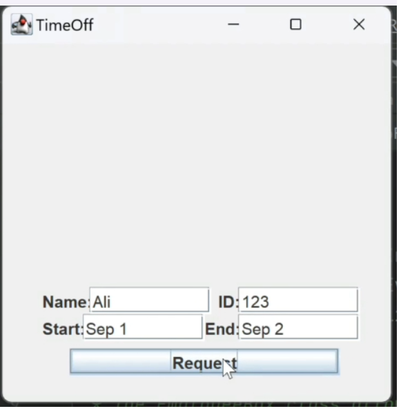

# HR Management System

This project delivers a system that allows a company to manage its employee schedules and pay.
A User of the system may be a manager or an employee. An employee can set their availability and can request time off using this system. The manager can generate their employees' schedules, have the system calculate their pay, and accept or reject time off requests.
___

## Table of Contents

- [Project Overview](#project-overview)
- [Technologies Used](#technologies-used)
- [Installation](#installation)
- [Usage](#usage)
- [Features](#features)
- [Design Patterns](#design-patterns)
___

## Project Overview
The HR Management System project is a Java software solution designed to streamline and automate various human resources processes within an organization. This project aims to simplify HR operations, improve efficiency, and enhance communication between HR personnel, employees, and management. The project provides a user-friendly interface for managing HR-related tasks and information.
___

## Technologies Used
**User interface components:** Java Swing - JFrame, JPanel, JButton, etc <br> 
**Layout Management:** layout managers - FlowLayout, GridLayout, etc <br> 
**Event handling:** Action Listener, Key Listener, MouseListener, etc <br> 
**Persistence and data storage:** JDBC for MYSQL Database, File I/O for CSV and TXT Files <br> 
**Version control and collaboration:** GitHub
___

## Installation
The following steps will guide you setting up the repo to run locally. 
1. Clone the repository to your machine:
   ```
   git clone https://github.com/CSC207-2023Y-UofT/course-project-hrmanagement.git
   ```
2. Open the cloned HR Management project folder in IntelliJ
4. Go to [Database Setup](database_setup.md) and follow the instructions to set up MYSQL database and configure connection details
12. Open the Gradle side panel. Under ./Tasks/build, run the 'build' command
13. Run the program from HRManagement class

___

## Usage or Functionality
1. Launch the application, opens "Choose you Position".   
   (_Note_: If you don't see both options, 'Manager' and 'Employee', try to resize the box.)
2. Select user position: either Manager or Employee.
3. In the **'Manager'** portal;
   - Manager has fixed userID and password:  
     _userID_: 1  
     _password_: manager
   - Manager has following 3 main functionalities:  
     i) _View Schedule  
     ii) View Time-off Requests  
     iii) Calculate Payroll_
4. In the **Employee** portal, employees can;
   - SignUp
   - Login  
     (_Note_: If you don't want to signUp, you can use this demo employeeID and login to test the program;   
     _employeeID_: 203, _password_: Samreen)  
     i) Request time-off 
___

## Features
___
### Manager Login
- Manager has a fixed ID and password;  
  _userID_: 1  
  _password_: manager
- If the userID and password does not match, it displays an error message.
- Demo:
  

### Employee SignUp and Login
- Employees have an option to signUp, details are stored in database, they can then login using the same employeeID and password that they used to signUp.
- When Employee tries to signUp with same id that has already been registered, or enters password that is less than 5 characters, appropriate error message is shown.
- Demo:  
  
___

### Payroll Feature

The payroll feature streamlines salary calculation, employee data management, and timesheet integration. It provides a user-friendly graphical interface for efficient interaction and computation of salaries for both employees and managers. Additionally, the feature integrates with the employee database and includes newly created employees in the payroll system. Finally, the feature saves each employee's salary calculation results to their respective timesheets, creating a comprehensive record of earnings. 

#### Key Functionalities

- **Salary Calculation**: this feature calculates employee salary based on the number of days and hours worked. It uses role-specific hourly rates and includes an option for adding bonuses.
- **Employee Data Management**: the Payroll Feature integrates with the employee database, and extracts relevant information for all existing and new employees for the salary calculation process.
- **Timesheet Integration**: users have the flexibility to fine-tune timesheet information -- start and end dates, hours per day, and bonuses. Once the salary is calculated, it is automatically saved/updated to the timesheet database. 
- **Data Validation**: the payroll feature verifies the correctness of input data, including date formats and numeric values. If any discrepancies or errors are detected, informative error messages guide users toward correcting the inputs.
- **Database Flexibility**: the payroll feature offers the versatility to read employee and timesheet data from either MySQL database or CSV files. 

**Note:** MYSQL Database is designed as the main database and is regularly updated with the creation of new employees and employees' corresponding timesheets. 
CSV is designed as a backup database with information on existing employees and does not currently support update features. All updates are done through MYSQL. 

#### GUI Functionality
The graphical interface (GUI) of the Payroll Feature is accessed through the manager portal.

**Employee List**: The GUI displays a list of employees, presenting their IDs, names and key information.
**Employee Selection**: Managers can select individual employees from the list for whom they want to calculate salaries.


**Timesheet Adjustment**: Once an employee is selected, the interface allows adjustments to timesheet details such as start date, end date, hours per day, and bonus amount.
The interface also displays the employee's previously calculated salary amount. Upon making necessary adjustments, users can initiate salary calculations by clicking the "Calculate" button.


**Payroll Information**: After calculation, the GUI presents a comprehensive payroll information list for the selected employee, and the employee's updated timesheet information and salary is saved to the database. 


**Data Validation Error Messages**: If the user selects or inputs invalid data, error message panels inform the user and guide them toward correcting the inputs.


[Payroll Demo](https://drive.google.com/file/d/1U3aP4xqz-Jdbn5f58FD-zv1Pss6saiWT/view?usp=sharing) <br>
<br>
This combination of functionalities allows users to efficiently manage payroll calculations for employees and managers, backed by accurate data and an intuitive interface.
___

### Time-Off Feature

The Time Off Feature provides a method of asynchronous communication for Time Off Requests between employees and managers. It includes a simple, easy to use graphical user interface and provides value to the end user by the various benefits brought on by having requests in a centralized location rather than having multiple bilateral communication channels open. This begins with employees being able to simply input their name, id, desired start and end dates and then allows manager to give an approved or denied status which employees can then see. Additionally, all parties can view a history of the latest time off requests and their statuses, allowing for employees to pre plan their requests in the case of a certain date range being already booked or requested.

#### Functionality Explanation & Demonstration
- **Asynchronous Employee Request Submission**
  
  <br>
  A typical usage scenario will begin with the employee initially requesting some time off.
  
  
  <br>
  Here we can see the employee submit two requests, after which the employee can exit the program and proceed with business as usual.
- **Asynchronous Manager Request Viewing**
  
  <br>
  The manager along with all employees will be able to view the latest time off requests for planning purposes.
  
  
  <br>
  Here we can see the manager approve the first request and deny the second. The manager can exit the program.
- **Asynchronous Employee Update Showcase**
  
  <br>
  Here we can see the employee able to view the results of their submitted requests and their updated status.
Note that Time Off request dates must be given in dd/mm/yy format to be appropriately integrated with the Schedule Feature. Failure to do so will result in loss of functionality.

___

### Schedule Feature
The Schedule Feature allows managers to view a brief overview of the current week's schedule, detailing the names and ids of employees working on each day. This feature keeps track of each worker's start/end dates as well as any time offs that they have which are approved.


___

## Design Patterns

In payroll, several design patterns are implemented: 
- **Strategy Design Pattern**: Two concrete classes, `MySQLDataAccess` and `CSVDataAccess`, implement the `DataAccessStrategy` interface. These strategies encapsulate the details of loading employee and timesheet data from their respective sources. The strategy pattern ensures the data access logic is separate from the core logic. It also allows for easy switching between data sources and better modularity and extendability.
- **Dependency Injection Pattern**: the `PayrollGUI` class receives an instance of the `TimesheetDAO` interface through its constructor, decoupling the PayrollGUI class from the specific implementation of the timesheet data access. This enables easy switching between the two different data access methods in the concrete implementation, `MySQLTimesheetDAO` and `CSVTimesheetDAO`. 
- **Singleton Pattern**: The `PayrollCalculator` class follows the Singleton pattern, ensuring a single instance is shared across the application to improve memory usage and performance.
- **Data Access Object Pattern**: The concrete classes `CSVEmployeeDAO`, `MySQLEmployeeDAO`, `CSVTimesheetDAO`, and `MySQLTimesheetDAO` implement the respective `EmployeeDAO` and `TimesheetDAO` interfaces. The DAO pattern encapsulates data operations within the DAO classes and decouples the application logic from the details of data storage.

In timeoff, design patterns are additionally implemented:
- **Strategy Design Pattern**: The `Modify` Use Case class implements the strategy design pattern by allowing all request, approval and denial processes to be handled in a single location via selecting an appropriate algorithm on the fly, with each button causing a call to a different class, `RequestTimeOff`, `AcceptTimeOff` and `RejectTimeOff` respectively, that will handle adding a request or modifying its status to either approved or denied.
- **Iterator Design Pattern**: The `History` GUI class is an implementation of the iterator design pattern, being called by the implementing main time off gui to iterate through the database containing past time off requests and allowing it to showcase the latest ones without having any explicit knowledge or understanding of the underlying representation or data structures.
- **Template Method Design Pattern**: The `TimeOffGUI` class implements the template method design pattern, being a template of the graphical user interface for the time off system, providing a baseline set of objects that all viewers will have. The template is then supplemented and fully fleshed out by the `EmployeeTimeOff` and `ManagerTimeOff` classes who add the finishing touches that are specific to employee and managers respectively.
- **Observer Design Pattern**: The `TimeOffGUI`, `EmployeeTimeOff`, `ManagerTimeOff` and `History` also implement the observer design pattern, with the TimeOffGUI allowing all users to observe the latest previous time off request submissions and their statuses. The employee and manager specific classes also refresh the GUI once a request has been submitted or had its status updated, allowing for users to observe the most recent data as well as see their actions change the resulting view.
