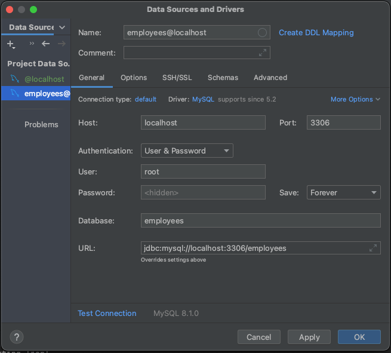

# HR Management System MYSQL Database Setup Guide

To create the database and tables in MYSQL necessary to run HR Management System locally, please follow these steps: 
1. Install MYSQL on your system (if not already installed)
2. On IntelliJ, open the Database sidebar, create New from MYSQL data source, and ensure the following attributes are used to create the data source:

   - Host: ```localhost``` <br>
   - Port: ```3306``` <br>
   - User: ```root``` <br>
   - Password: ```password``` <br>
   - Database: ```employees``` <br>
   - URL: ```jdbc:mysql://localhost:3306/employees``` <br>
   <br>
   
     

<br>

3. Access MySQL Command-Client: open Command Prompt or Terminal window. If you have set up MySQL to be in your system's PATH, you can simply type mysql and press Enter
4. Create a new database `employees` by using the following command:
   ```
   CREATE DATABASE employees;
   USE employees;
   ```
   
5. Create Table `employees` by entering the following command:
   ```
   create table employees
   (
   EMPLOYEEID int auto_increment primary key,
   LASTNAME varchar(50) null,
   FIRSTNAME varchar(50) null,
   ADDRESS varchar(100) null,
   PHONENUMBER varchar(15) null,
   PASSWORD varchar(50) null,
   ROLE varchar(15) default 'Employee' null
   );
   ```
   
6. Create Table `timesheets` by entering the following command:
   ```
   create table timesheets
   (
   EMPLOYEEID int auto_increment primary key,
   LASTNAME varchar(50) null,
   FIRSTNAME varchar(50) null,
   STARTDATE varchar(10) null,
   ENDDATE varchar(10) null,
   SALARY double default 0
   );
   ```
   
7. Insert default data into the `employees` table:
   ```
   INSERT INTO employees (EMPLOYEEID, LASTNAME, FIRSTNAME, ADDRESS, PHONENUMBER, PASSWORD, ROLE)
   VALUES
   ('1', 'Johnson', 'Bob', '123 King St.', '123456789', 'manager', 'Manager'),
   ('2', 'Smith', 'John', '111 Maple Rd.', '777373737', 'password2', 'Employee'),
   ('3', 'Williams', 'Jane', '234 Gamble Rd.', '111122333', 'password3', 'Employee'),
   ('4', 'Hill', 'Sandra', '888 Queen St.', '8888282828', 'password4', 'Employee');
   ```
   
8. Insert default data into `timesheets` table:
    ```
    INSERT INTO timesheets (EMPLOYEEID, LASTNAME, FIRSTNAME, STARTDATE, ENDDATE, SALARY)
    VALUES
    ('1', 'Johnson', 'Bob', '2023/07/01', '2023/07/31', 11000),
    ('2', 'Smith', 'John', '2023/07/01', '2023/07/31', 9300),
    ('3', 'Williams', 'Jane', '2023/07/01', '2023/07/31', 9300),
    ('4', 'Hill', 'Sandra', '2023/07/01', '2023/07/31', 9300);
    ```
9. Return to [README installation](README.md#installation) to finish the remainder of the installation process
